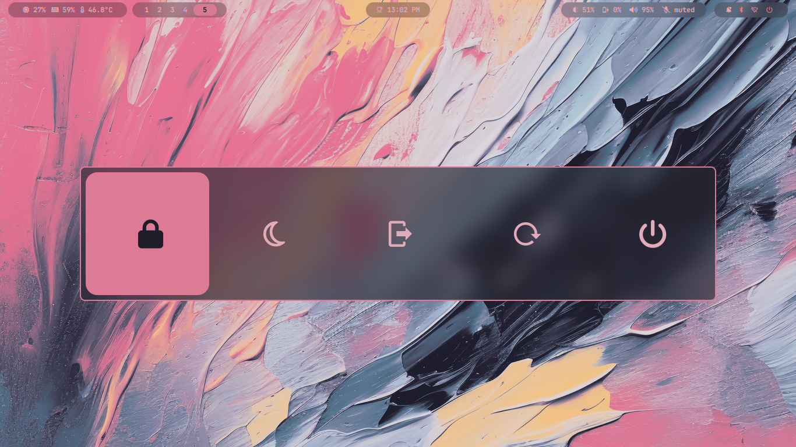
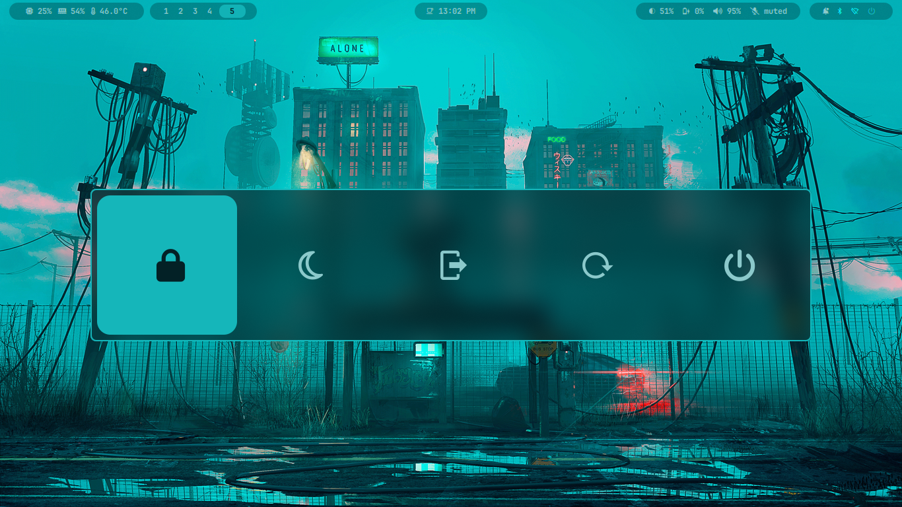
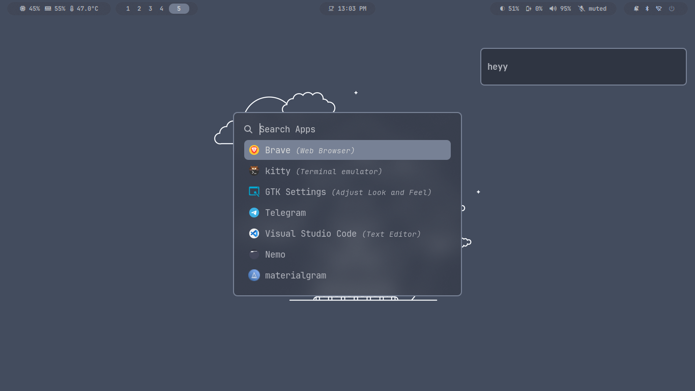
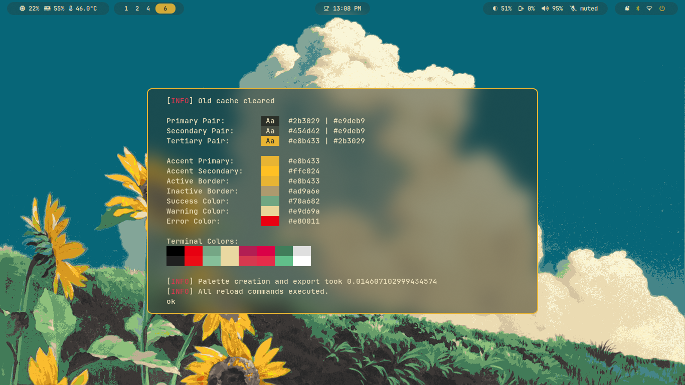
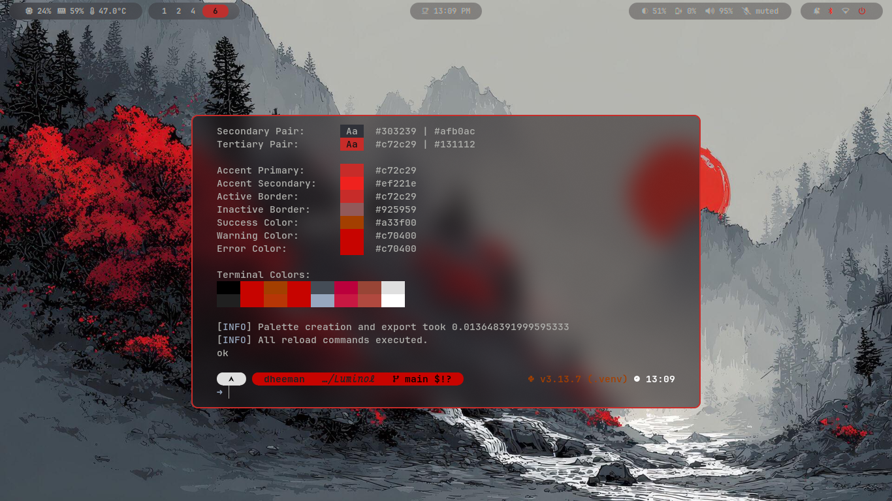
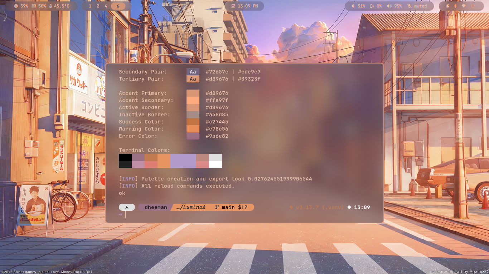
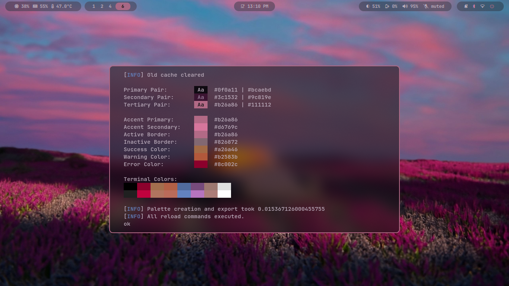

# Luminol

Luminol is a theming engine that extracts color palettes from your wallpaper and applies them as themes to your system
applications. It reads an image, generates a theme, and uses user-defined configuration to export color configurations
for terminal emulators, text editors, window managers, and more.

## Features

- **Dynamic Theming**: Generate themes from any image.
- **Highly Configurable**: Use a simple `config.toml` file to control everything.
- **Template-Based**: Create themes for any application that uses text-based configuration files.
- **Flexible Color Formats**: Output colors in various formats like `hex`, `rgb`, etc.
- **Color Transformations**: Adjust hue, saturation, brightness, and more.
- **Daemon Mode**: Run as a background daemon (`lumid`) for faster execution.

## Screenshots

Here are some screenshots of themes generated by Luminol on my personal desktop configuration.

 
 
 


## Requirements

- Python 3.11 or newer.

## Installation

This project is packaged for Arch Linux.

### Prerequisites

First, ensure you have `git` and the `base-devel` group installed, which are required to build packages:

```bash
sudo pacman -S --needed git base-devel
```

### Build and Install from Source

It is recommended to build from the latest stable release tag to ensure you are using a tested version.

1.  **Clone the specific release tag.** You can replace `v0.1.0a1` with a different version in the future.

    ```bash
    git clone --branch v0.1.0a1 https://github.com/dheemansa/Luminol.git
    ```

2.  **Navigate into the directory and build the package.** `bash     cd Luminol     make local-build     ` This process
    uses the `PKGBUILD` to create and install a package that can be managed by `pacman`.

## Usage

### Direct Mode

The `lumi` command is used for direct, one-shot execution.

```bash
# Generate and apply a theme from an image
lumi -i /path/to/your/image.jpg
```

### Daemon Mode

The `lumid` command manages the background daemon for faster, repeated runs.

```bash
# Start the daemon
lumid start

# Run color generation and apply theme
lumid run -i /path/to/image.jpg

# Stop the daemon
lumid stop
```

## Configuration (`config.toml`)

Luminol is configured using a `config.toml` file located at `$XDG_CONFIG_HOME/luminol/config.toml`.

### `[global]` Settings

This section controls the global behavior of Luminol.

```toml
[global]
# Command to set the wallpaper. Use {wallpaper_path} as a placeholder.
wallpaper-command = "swww img {wallpaper_path}"

# Theme type: "auto", "light", or "dark". Defaults to "auto".
theme-type = "dark"

# Commands to run after applying a theme.
reload-commands = ["hyprctl reload", "killall -USR1 waybar"]

# Whether to execute commands using the system shell.
# Default: false
use-shell = false

# Whether to reload current terminal colors.
# Default: true
tty-reload = true

# Whether to log output from commands.
# Default: false
log-output = false
```

### Application Settings

You can define settings for each application you want to theme in its own section (e.g., `[rofi]`, `[dunst]`).

```toml
[rofi]
# Enable or disable this application's theme generation.
enabled = true

# Path to the output file.
output-file = "~/.config/rofi/colors.rasi"

# Color format for the output.
# Valid values: hex6, hex8, hex6value, hex8value, rgb, rgba, rgb_decimal, rgba_decimal
color-format = "hex8"

# Syntax for each color line.
syntax = "*{{name}: {color};}"

# (Optional) Path to a template file.
template = "rofi-template.rasi"

# (Optional) Enable custom color mapping.
remap-colors = false
```

### Color Generation Modes

Luminol has three main modes for generating color files, processed in this order of priority:

1.  **Template Mode**: Activated if the `template` key is present.
2.  **Custom Mapping Mode**: Activated if `remap-colors = true` and no `template` is set.
3.  **Default Mode**: The fallback when neither of the above is enabled.

---

### Understanding `syntax` and Placeholders

The `syntax` parameter is a crucial part of Luminol's configuration, acting as a blueprint for how your color files are
generated.

#### What is `syntax`?

The `syntax` parameter is a **pattern template** that tells Luminol how to format each line of output in your generated
color file. Think of it as a recipe that defines the structure of each color definition.

#### What are Placeholders?

Placeholders are special keywords that Luminol replaces with actual values when generating your color files.

- `{name}`: Replaced with the color's variable name (e.g., `bg-primary`).
- `{color}`: Replaced with the actual color value in your specified `color-format` (e.g., `#1e1e2e`).
- `placeholder`: A special keyword used **only** in Template Mode.

#### How `syntax` Works: Detailed Examples

- **CSS Variables**:
    - Config: `syntax = "--{name}: {color};"`
    - Output: `--bg-primary: #1e1e2e;`

- **Shell Variables**:
    - Config: `syntax = "export {name}=\"{color}\""`
    - Output: `export bg-primary="#1e1e2e"`

- **TOML/INI**:
    - Config: `syntax = "{name} = \"{color}\""`
    - Output: `bg-primary = "#1e1e2e"`

#### Using Literal Curly Braces `{}`

If you need literal curly braces in your output, just use any text inside them that is not a reserved placeholder.
Luminol only treats `{name}`, `{color}`, and `{placeholder}` as special.

- Config: `syntax = "color: {static}; var: {color};"`
- Output: `color: {static}; var: #1e1e2e;`

---

### Mode 1: Default Mode

This is the **simplest mode**, used when you don't specify a `template` or enable `remap-colors`.

- **What it does**: Exports the 13 standard UI semantic colors automatically. ANSI terminal colors are not included.
- **Use Case**: Perfect for quickly generating a simple file of color variables.

#### Key Characteristics

- ✅ Simple and quick to set up.
- ❌ No customization of color names.
- ❌ Cannot apply color transformations.

#### Example: Basic CSS colors

```toml
[css-vars]
output-file = "colors.css"
color-format = "hex6"
syntax = "--{name}: {color};"

```

---

### Mode 2: Custom Mapping Mode

This mode gives you **full control** over which colors are exported, what they're named, and how they are transformed.

- **Activation**: Set `remap-colors = true` and define your colors in an `[app_name.colors]` table. The `template` key
  must not be set.
- **Use Case**: Creating themes for applications with specific variable names (like terminal emulators) or when you need
  to transform colors.

#### Key Characteristics

- ✅ Complete control over color selection and naming.
- ✅ Apply transformations (`brightness`, `opacity`, etc.) to any color.
- ✅ Export only the colors you need.

#### Example: Kitty Terminal Configuration

```toml
[kitty]
output-file = "~/.config/kitty/colors.conf"
color-format = "hex6"
syntax = "{name} {color}"
remap-colors = true

[kitty.colors]
# Kitty-specific naming convention
background = { source = "bg-primary" }
foreground = { source = "text-primary" }
cursor = { source = "accent-primary" }

# Map all 16 ANSI colors
color0 = { source = "ansi-0" }
color1 = { source = "ansi-1" }
# ... and so on for all 16 ansi colors ...
color15 = { source = "ansi-15" }

```
> **Note:** Using `ansi-*` colors as a `source` for file-based themes is a planned feature and is not yet implemented. This example shows the future intended usage.

---

### Mode 3: Template Mode

Template Mode is the **most powerful and flexible** mode, designed for theming applications with complex or monolithic
configuration files.

- **Activation**: Simply add the `template` key to your application's configuration.
- **Use Case**: Theming an entire application config file where color definitions are mixed with other settings.

#### How It Works

Luminol takes an entire file you provide (the `template`) and replaces special placeholder markers within it with actual
color values. It preserves all other content, including comments and formatting.

#### The `placeholder` Keyword

In this mode, the `syntax` parameter works differently. It defines the **pattern** that Luminol uses to find color
markers in your template. The literal keyword **`placeholder`** is essential here.

- If `syntax = "{placeholder}"`, Luminol will search your template file for `{bg-primary}`, `{text-primary}`, etc.
- If `syntax = "COLOR_placeholder"`, it will search for `COLOR_bg-primary`, `COLOR_text-primary}`, etc.

**Note**: The `syntax` in Template Mode **only** uses the word `placeholder`. It does **not** use `{name}` or `{color}`.

#### Example: Dunst Notification Theme

- **Config (`config.toml`)**:

```toml
[dunst]
output-file = "~/.config/dunst/dunstrc"
color-format = "hex6"
template = "dunstrc-template" # Path to your template
syntax = "{placeholder}"
```

- **Template file (`dunstrc-template`)**:

```ini
# Dunst notification theme
[urgency_low]
    background = "{bg-primary}"
    foreground = "{text-secondary}"
    frame_color = "{border-inactive}"

[urgency_normal]
    background = "{bg-secondary}"
    foreground = "{text-primary}"
    frame_color = "{accent-primary}"
```

- **Generated output (`dunstrc`)**:

    Luminol reads the template, replaces the `{...}` markers with the actual colors, and writes the complete, themed
    file to `dunstrc`.

    ```ini
    # Dunst notification theme
    [urgency_low]
        background = "#1e1e2e"
        foreground = "#b0b0b0"
        frame_color = "#404040"

    [urgency_normal]
        background = "#2a2a3a"
        foreground = "#e0e0e0"
        frame_color = "#6495ff"

    ```

For even more detailed examples and advanced usage, please refer to the `Plan/FINAL_PLAN.md` document.

### Available Colors

Luminol generates a set of 13 UI semantic colors and 16 ANSI terminal colors. These can be used as source colors in your
configuration.

**UI Colors**: `bg-primary`, `bg-secondary`, `bg-tertiary`, `text-primary`, `text-secondary`, `text-tertiary`,
`accent-primary`, `accent-secondary`, `error-color`, `warning-color`, `success-color`, `border-active`,
`border-inactive`.

**ANSI Colors**: `ansi-0` to `ansi-15`.

### Color Transformations

When using Custom Mapping or Template mode with `remap-colors = true`, you can apply transformations to colors:

```toml
[my_app.colors]
# Example of transformations
custom-name = { source = "text-primary", brightness = 1.2, opacity = 0.8 }
```

**Available Transformations**: `hue`, `saturation`, `brightness`, `contrast`, `temperature`, `opacity`.

## Acknowledgements

- The foundational 4-bit ANSI color generation logic used as a fallback theme is based on the excellent
  [4bit project](https://github.com/ciembor/4bit) by Maciej Ciemborowicz.
- This project was heavily inspired by the pioneering work of [pywal](https://github.com/dylanaraps/pywal).
